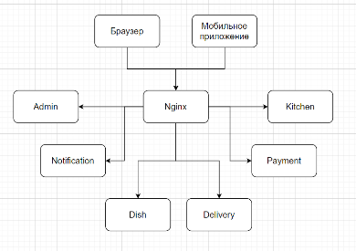

# Проект "Быстро и в точку"

Техническое задание:
- имеет каталог блюд;
- может принимать заказы клиента на сайте. Либо через скачанное клиентами приложение;
- предоставляет клиенту курьерскую доставку. Клиент может контролировать положение курьера;
- предоставляет курьерам приложения, где они могут отчитываться о заказах, обновлять свое положение;
- имеет админку в виде веб-приложения, где можно оформлять поставки продуктов, а также видеть прибыль.

Приложение состоит из maven модулей. Каждый модуль - отдельное Spring boot приложение.

## Структуру проекта:
```
/admin/ - админка
/dish/ - сервис блюд
/person/ - сервис пользователей
/order/ - сервис заказов
/delivery/ - сервис доставки
/kitchen/ - сервис кухни
/payment/ - сервис платежей
/notification/ - сервис уведомлений
/domains/ - доменные модели
```

## Архитектура:

